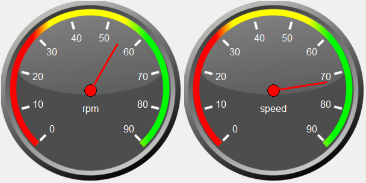

# Tkinter-Gauge-Chart
Tkinter-based class to easily implement gauge charts to your Tkinter projects.



To incorporate this add-on widget simply import the module and place as many gauges as you wish into tkinter frames.
Because object-oriented programming was used, this code is versatile in handling the multiplte gauge instances.

```python
import tkinter as tk
import gaugechart
import random

root = tk.Tk()

gaugeFrame = tk.Frame(root)
gaugeFrame.pack(side=tk.RIGHT)
myGauge = gaugeApp(gaugeFrame, 0, 100, "speed")
root.after(2000,lambda: mygauge1.set_dial( random.randint(0,90) ))

root.mainloop()
```
